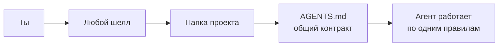
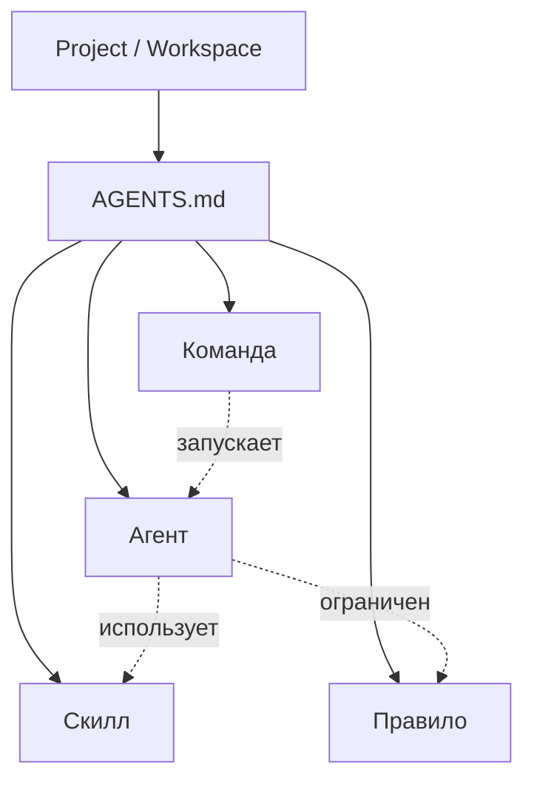

# Вики — Agent-ready система

> [!note] Это инструкция для тех, кто видит схемы быстрее, чем читает абзацы.
> Каждая страница короткая, с примерами и диаграммами. Можно открыть в Obsidian — все wiki-ссылки уже работают.

## Что это

Это система, которая делает любую папку понятной для **OpenCode**, **Claude Code**, **Codex** и **Gemini** одинаково. Один проект — четыре агента, одинаковые правила.



## Начни отсюда

1. [[обзор]] — что и зачем за 1 минуту
2. [[установка]] — как поставить
3. [[концепции/README|Концепции]] — 4 главных понятия
4. [[workflow/README|Workflow]] — как работать каждый день
5. [[шпаргалка]] — все команды на одной странице

## Карта вики

```
📂 docs/wiki/
├── 📄 обзор                    зачем всё это
├── 📄 установка                как поставить
├── 📄 структура-файлов         карта всех файлов
├── 📄 безопасность             что можно и что нельзя
├── 📄 шпаргалка                команды на одной странице
├── 📄 faq                      частые вопросы
├── 📂 концепции/
│   ├── агент                   роль (кто делает)
│   ├── скилл                   процедура (как делает)
│   ├── правило                 ограничение (что нельзя)
│   └── команда                 слэш-команда (/plan, /review)
├── 📂 шеллы/
│   ├── opencode                основной
│   ├── claude-code             от Anthropic
│   ├── codex                   от OpenAI
│   └── gemini                  от Google
└── 📂 workflow/
    ├── первый-промпт           готовый текст для копи-пейста
    ├── дневной-цикл            git → /analyze → /plan → ...
    └── пример-задачи           полный пример от и до
```

## Связи между понятиями



Каждое понятие — отдельная страница: [[концепции/агент|агент]], [[концепции/скилл|скилл]], [[концепции/правило|правило]], [[концепции/команда|команда]].
