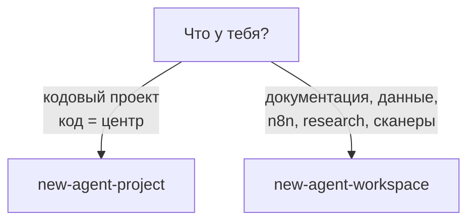
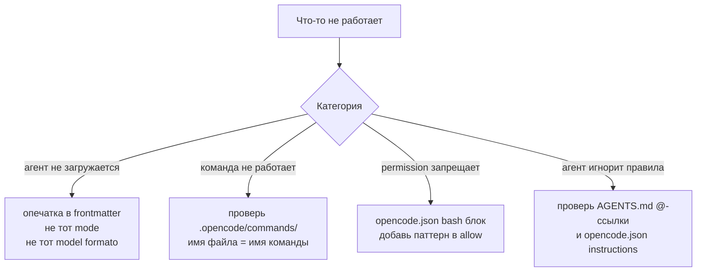

# FAQ

## Зачем я нужен, если есть AI?

Чтобы AI был **предсказуемым**. Без правил агент всё равно работает — но непонятно как, без бэкапов, иногда коммитит секреты. С правилами поведение **стабильное**.

## Workspace или Project — что выбрать?



| Workspace | Project |
|---|---|
| docs/research/data/n8n | код-первый |
| 10 агентов / 10 скиллов | минимальный |
| `.opencode/agents/` и т.д. | только AGENTS.md + docs/ |

## Где живут агенты?

`.opencode/agents/<slug>.md` — один файл = один агент. OpenCode сам подхватывает.

[[концепции/агент]]

## Можно ли поставить агента в `opencode.json`?

Можно, но **не нужно** в workspace-шаблоне. Файлы `.md` — единственный источник. `opencode.json` хранит только глобальные `permission` и `instructions`.

## Claude Code не видит моих агентов

Claude ищет в `.claude/agents/`. У нас в `.opencode/agents/`. Решения:

1. Просто скажи: `Read .opencode/agents/planner.md and act as that agent.`
2. Сделай симлинки: см. [[шеллы/claude-code#Вариант 2 — Симлинки|инструкцию]]

## Почему `model: sonnet` ломает OpenCode?

OpenCode требует формат `<provider>/<model>` — `anthropic/claude-sonnet-4-6`. Bare alias `sonnet` валит загрузку с `ProviderModelNotFoundError`.

Решение: **не указывать `model:` в шаблоне** — пусть пользователь сам выберет модель.

## Что такое `/fix` и где он?

Был. Удалён. Реализация теперь **вручную**:

```
/plan <задача>            план в docs/plans/
(читаешь план, делаешь сам)
/review                   проверка
```

## Можно ли коммитить через агента?

Нет — настройка по умолчанию. Если очень нужно — попроси явно: `please commit these changes with message X`. Но push **всегда вручную**.

## Куда смотреть когда что-то сломалось



## Можно ли я переименую агента?

Да:

```bash
mv .opencode/agents/planner.md .opencode/agents/strategist.md
```

Имя файла = имя агента. Не забудь обновить:
- `AGENTS.md` (таблица агентов)
- `.opencode/commands/*.md` где `agent: planner`
- `opencode.json` если `default_agent` ссылался

## А если работаю один — нужен ли вообще `AGENTS.md`?

Да. Без него каждый чат с агентом начинается с нуля. С `AGENTS.md` агент сразу знает правила, безопасные/опасные команды, и где что лежит.

## Где новые промпты пробовать?

`prompts/` в workspace. Подходит для drafts и экспериментов до того, как промпт станет полноценным [[концепции/скилл|скиллом]] или [[концепции/команда|командой]].

## Связано

- [[шпаргалка]] — быстрый референс
- [[обзор]] — общая картина
