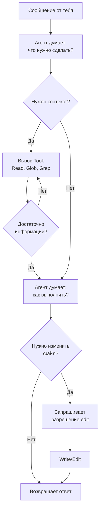
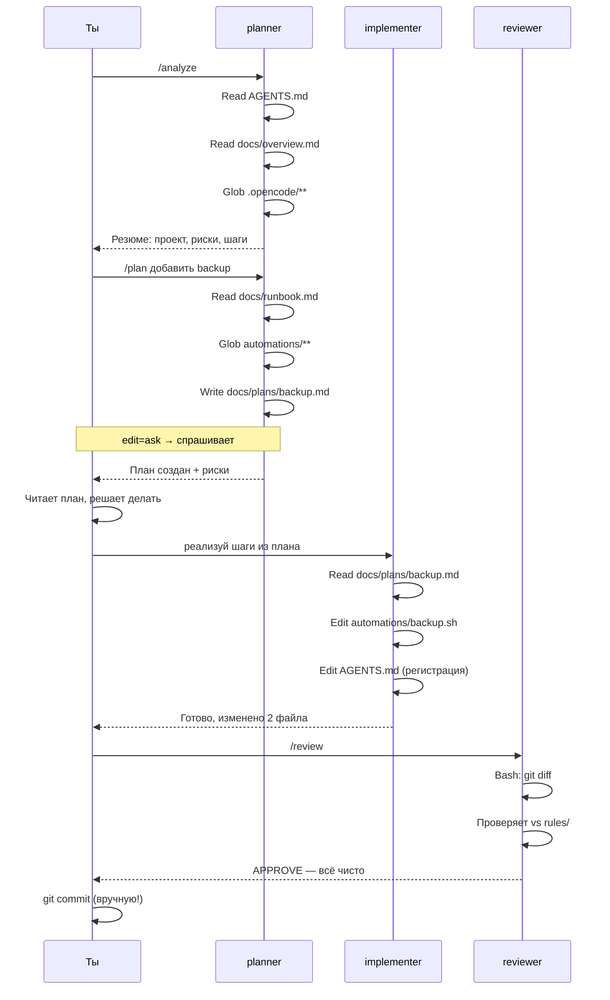
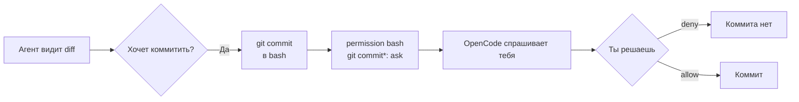

# Workflow глазами агента

> Как агент «думает» и работает изнутри. Что он видит, как решает, что делает.

## Старт: что агент получает при запуске

Когда ты пишешь `/plan`, OpenCode собирает контекст:

```
┌─ SYSTEM PROMPT ──────────────────────────────────────────┐
│                                                          │
│  Описание агента (из agents/planner.md)                 │
│  + AGENTS.md — контракт проекта                         │
│  + rules/dispatch-policy.md — кому что можно            │
│  + rules/workflow.md — как работаем                      │
│                                                          │
│  Tools доступные агенту:                                 │
│    Read, Glob, Grep (всегда allow)                       │
│    Write, Edit     (ask — спросит)                       │
│    Bash            (ask для большинства)                 │
│    git push        (deny — запрещено)                    │
│                                                          │
└──────────────────────────────────────────────────────────┘

┌─ USER MESSAGE ───────────────────────────────────────────┐
│  Промпт из commands/plan.md раскрылся в:                │
│  "Analyze the workspace context, identify the task...    │
│   Write the plan to docs/plans/<slug>.md..."            │
└──────────────────────────────────────────────────────────┘
```

## Цикл принятия решений



## Три ключа архитектуры

### 1. AGENTS.md — контракт

Каждый агент читает `AGENTS.md` как первый шаг. Там написано:

```markdown
## Rules
- Do not push.
- Do not commit unless explicitly requested.
- Ask before destructive commands.
- Protect secrets, data, backups, databases, Docker volumes.
- Stop and re-plan on surprises.

## First action
1. Classify task.
2. Read relevant rules.
3. Plan before editing.
```

Это **не просьба** — это контракт, который агент принял в system prompt. Нарушить его = выйти за рамки инструкций.

### 2. dispatch-policy.md — маршрутизация

```markdown
## Routing rules
- Planning, analysis → planner agent
- Data work, SQL, inventory → data-operator agent
- Code implementation → implementer agent
- Pre-commit review → reviewer agent
```

Агент сам читает и решает: «эта задача про данные → передаю data-operator». Он может делегировать, не спрашивая тебя.

### 3. Permission блок — тормоза

Даже если агент «захотел» сделать что-то разрушительное — permission это запрещает на уровне OpenCode, не на уровне промпта:

```yaml
permission:
  bash:
    "git push*": deny    ← OpenCode блокирует, не агент
    "rm -rf *": deny
    "*": ask             ← всё остальное — спрашивает
```

**Это последняя линия защиты.** Не нужно надеяться только на инструкции — permission работает независимо.

## Полный жизненный цикл задачи



## Что агент делает на каждом шаге

### `/analyze` — planner в read-only режиме

```
1. Читает AGENTS.md
2. Читает README.md, docs/overview.md, docs/runbook.md
3. Glob .opencode/** — что за агенты/команды
4. Смотрит git status (allow)
5. НЕ редактирует ничего
6. Возвращает: тип проекта, риски, следующий шаг
```

### `/plan <task>` — planner пишет план

```
1. Читает контекст (AGENTS.md, overview, rules)
2. Ищет похожие файлы (Glob, Grep)
3. Читает связанные правила
4. Думает: шаги, риски, зависимости
5. Создаёт docs/plans/<slug>.md (ask → ждёт твоего OK)
6. Возвращает: ссылку на план + риски
```

### `/review` — reviewer только читает

```
1. git diff (allow — без спроса)
2. git status (allow)
3. Читает изменённые файлы
4. Сверяет с rules/security.md, rules/git-operations.md
5. НЕ редактирует ничего
6. Возвращает: APPROVE / REQUEST_CHANGES / BLOCK + причины
```

## Почему агент не коммитит

Это принципиальное решение архитектуры:



Но в нашем шаблоне workflow.md написано явно: «не коммить без явного запроса». Агент следует этому правилу сам, а permission — страховка.

**Почему это важно:**
- Ты видишь diff перед коммитом
- Агент мог изменить больше, чем ты ожидал
- Коммит = твоя ответственность

## Как агент делегирует

Если `planner` видит задачу для другого агента:

```
Пользователь: "обнови inventory.md"
Planner думает: "это data-operator, не я"
Planner: вызывает subtask с agent=data-operator
data-operator: выполняет задачу
Planner: возвращает результат тебе
```

Это прозрачно — ты не видишь делегирование, только результат. Если хочешь видеть — смотри в `--verbose` режиме.

## Связано

- [[../провайдеры]] — какую модель использует агент
- [[../конфиг-уровни]] — откуда берётся конфиг агента
- [[дневной-цикл]] — твой взгляд на тот же процесс
- [[../концепции/агент]] — что такое агент
