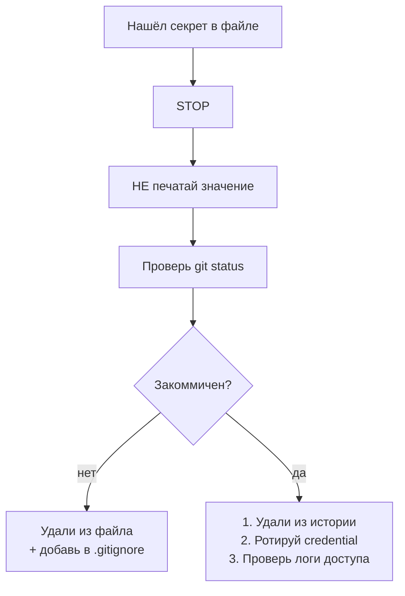
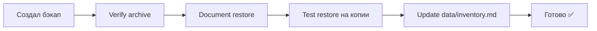

# Безопасность

> Главный принцип: **агент ничего не пушит, не коммитит, не удаляет без явного "да"**.

## Никогда не коммитить

```
.env / .env.*
auth.json / credentials / tokens
*.key / *.pem
OAuth credentials
~/.codex/auth.json
~/.claude/
~/.gemini/oauth_creds.json
database dumps (*.sql, *.dump)
n8n exports с credentials
backup archives (*.tar.gz, *.zip)
sqlite файлы с реальными данными
broker credentials
private CSV exports
```

## Никогда не запускать автоматически

```
rm -rf
git reset --hard
git push --force
git clean -fd
docker volume rm
docker system prune
database DROP / TRUNCATE
format
```

## Спросить перед

```
- установкой инструментов
- сменой credentials
- открытием webhook
- открытием порта
- изменением Docker volume
- удалением файлов
- перемещением важных папок
- изменением глобального конфига
```

## Если нашёл секрет



## Печатать секреты

❌ Никогда не выводить **значения** секретов в чат, логи, отчёты.

✅ Использовать плейсхолдеры:

```
<API_KEY>
<TOKEN>
<PASSWORD>
<SECRET_PATH>
```

## Финансовые данные

```mermaid
flowchart LR
    F[market data / scanner]
    F --> R[research / analytics<br/>✅ можно]
    F --> S[signals / watchlists<br/>✅ можно]
    F --> T[execute trades<br/>❌ запрещено по умолчанию]
    F --> A[advice / "buy this!"<br/>❌ нет]
```

Всегда:
- источник данных
- предположения
- ограничения
- disclaimer: research-only, not financial advice

## Бэкапы

> [!warning]
> Бэкап без проверенного restore = **не бэкап**.



## Pre-flight чеклист (перед опасной операцией)

```
[ ] backup существует
[ ] restore path задокументирован
[ ] git status чистый
[ ] target path правильный
[ ] environment правильный (WSL / Docker / cloud)
[ ] есть одобрение пользователя
```

## Связано

- [[концепции/правило]] — .opencode/rules/security.md
- [[workflow/дневной-цикл]]
