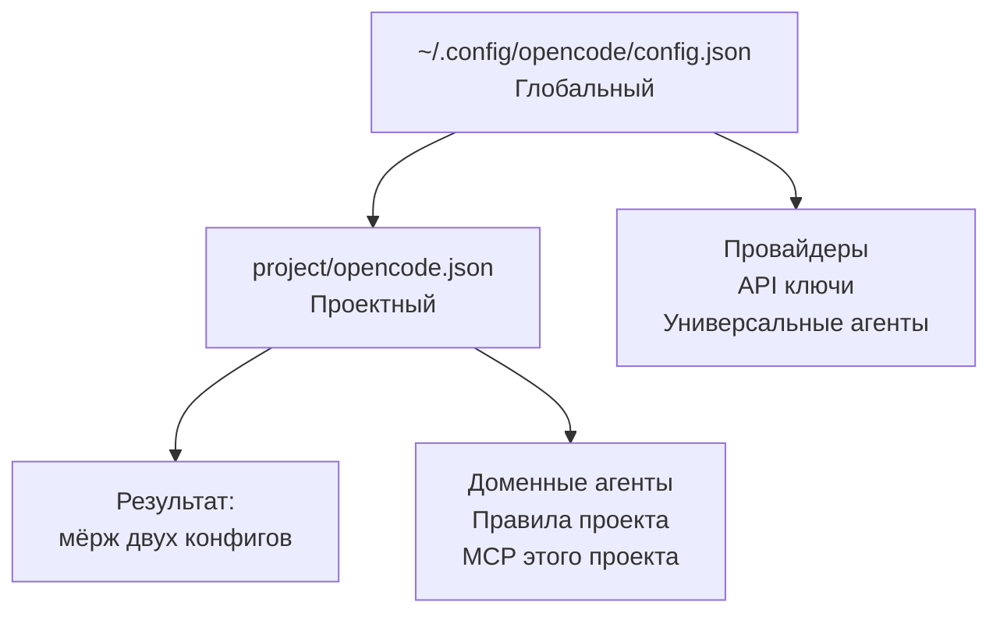

# Global vs Project конфиг

> Два уровня конфига. Глобальный — для всех проектов. Проектный — для конкретного.

## Схема наследования



Проектный конфиг **переопределяет** глобальный там, где они пересекаются.

## Что куда класть

### Глобальный `~/.config/opencode/config.json`

```json
{
  "provider": {
    "anthropic": {},
    "ollama": {
      "npm": "@ai-sdk/openai-compatible",
      "name": "Ollama (local)",
      "options": { "baseURL": "http://localhost:11434/v1" }
    }
  },
  "default_agent": "planner",
  "instructions": [
    "AGENTS.md"
  ]
}
```

| Что | Почему сюда |
|---|---|
| Провайдеры и API ключи | Одни для всех проектов |
| Универсальные агенты | code-helper, writer работают везде |
| `/analyze`, `/review`, `/plan` | Дефолтные команды |
| Базовые permission | Безопасные умолчания |
| Ollama / LM Studio URL | Один сервер на всё |

### Глобальные агенты и команды

```
~/.config/opencode/
├── agents/
│   ├── code-helper.md      ← доступен везде
│   └── writer.md           ← доступен везде
├── skills/
│   └── commit-message/
│       └── SKILL.md        ← доступен везде
└── commands/
    ├── analyze.md
    ├── review.md
    └── plan.md
```

### Проектный `project/opencode.json`

```json
{
  "default_agent": "data-operator",
  "instructions": [
    "AGENTS.md",
    ".opencode/rules/dispatch-policy.md",
    ".opencode/rules/workflow.md"
  ],
  "mcp": {
    "postgres": {
      "type": "local",
      "command": ["npx", "-y", "@modelcontextprotocol/server-postgres", "${DATABASE_URL}"]
    }
  }
}
```

| Что | Почему сюда |
|---|---|
| `data-operator` агент | Специфичен для data-workspace |
| `dispatch-policy.md` | Правила роутинга этого проекта |
| MCP postgres | Этот конкретный инстанс БД |
| `default_agent` | Может отличаться от глобального |

### Проектные агенты

```
project/.opencode/
├── agents/
│   ├── planner.md          ← только в этом проекте
│   ├── reviewer.md
│   └── data-operator.md    ← доменный агент
├── skills/
│   └── backup-restore/
│       └── SKILL.md
├── commands/
│   ├── plan.md             ← переопределяет глобальный
│   └── intake.md
└── rules/
    ├── dispatch-policy.md
    └── workflow.md
```

## Таблица решений

| Нужно добавить | Куда |
|---|---|
| Новый провайдер (OpenRouter) | Global config |
| Ollama с локальной моделью | Global config |
| Агент для всех проектов (code-helper) | `~/.config/opencode/agents/` |
| Агент только для data workspace | `project/.opencode/agents/` |
| MCP для GitHub (везде нужен) | Global config |
| MCP для конкретной Postgres БД | Project config |
| `/analyze`, `/review` | Global commands |
| `/deploy` для конкретного проекта | Project commands |
| Правило «не пушить» | Global — базовое<br/>Project — конкретизация |

## Пример: добавить OpenRouter глобально

```bash
# Добавить ключ
export OPENROUTER_API_KEY="sk-or-..."
echo 'export OPENROUTER_API_KEY="sk-or-..."' >> ~/.bashrc

# Добавить провайдер в конфиг
# ~/.config/opencode/config.json
```

```json
{
  "provider": {
    "anthropic": {},
    "openrouter": {}
  }
}
```

Теперь в любом проекте можно указать:

```yaml
---
model: openrouter/anthropic/claude-3-haiku
---
```

## Пример: агент только для одного проекта

В `my-project/.opencode/agents/docker-manager.md`:

```yaml
---
description: Управляет Docker compose стеком этого проекта
mode: primary
permission:
  bash:
    "*": ask
    "docker compose ps*": allow
    "docker compose logs*": allow
    "docker compose down*": ask
---

# Docker Manager

Знает стек этого проекта, читает docker-compose.yml.
```

Этот агент виден только внутри `my-project/`.

## Связано

- [[провайдеры]] — список провайдеров и настройка
- [[шеллы/opencode]] — синтаксис opencode.json
- [[структура-файлов]] — карта всех файлов
