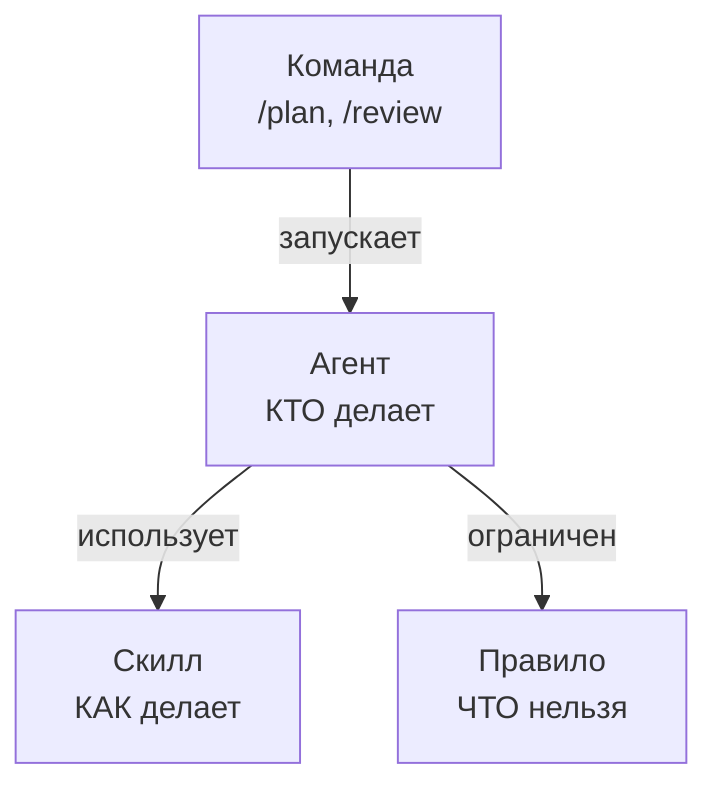

# Концепции

Всего **4 понятия**. Запомни их — дальше будет легче.



## Таблица сравнения

| | Что это | Где живёт | Пример |
|---|---|---|---|
| [[агент]] | роль / персонаж | `.opencode/agents/<slug>.md` | `planner`, `reviewer` |
| [[скилл]] | пошаговая процедура | `.opencode/skills/<slug>/SKILL.md` | `backup-restore`, `brainstorm` |
| [[правило]] | константа / запрет | `.opencode/rules/<slug>.md` | `git-operations.md`, `security.md` |
| [[команда]] | слэш-команда | `.opencode/commands/<slug>.md` | `/analyze`, `/plan` |

## Простая аналогия

```
АГЕНТ      = сотрудник на должности (планировщик, ревьюер)
СКИЛЛ      = инструкция как делать конкретную процедуру
ПРАВИЛО    = корпоративный кодекс (никогда X, всегда Y)
КОМАНДА    = горячая клавиша в чате (/plan === позови планировщика)
```

## Когда что использовать

| Хочешь чтобы… | Используй |
|---|---|
| у тебя была новая «роль» (например, «дизайнер БД») | новый [[агент]] |
| есть пошаговая процедура для повторяющейся задачи | новый [[скилл]] |
| запретить что-то на уровне всего проекта | новое [[правило]] |
| сделать удобный шорткат `/команда` | новая [[команда]] |

## Дальше

- [[агент]] — кто, как описывать, пример файла
- [[скилл]] — как, формат `SKILL.md`
- [[правило]] — что нельзя, примеры
- [[команда]] — как создавать слэш-команды
