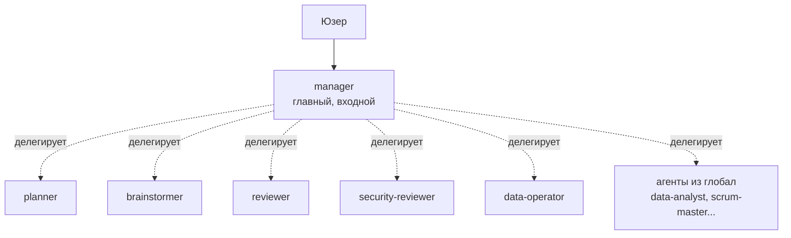

# Агент

> **Агент = роль.** Кто выполняет задачу. Со своим характером и ограничениями.

## Главный паттерн — `manager` + специалисты

В шаблоне есть один **входной** агент — `manager`. Юзер всегда пишет ему.
`manager` сам классифицирует задачу и вызывает нужного специалиста через `task` tool.



Почему так:
- юзер не угадывает «кого выбрать»
- `manager` знает таблицу маршрутизации (см. `.opencode/agents/manager.md`)
- специалисты остаются маленькими и фокусированными
- `manager` синтезирует результаты в один ответ

Полный список — в `AGENTS.md` workspace-шаблона.

## Где живёт

```
.opencode/agents/planner.md
.opencode/agents/reviewer.md
.opencode/agents/security-reviewer.md
...
```

Имя файла = имя агента.

## Формат файла

```markdown
---
description: Одно предложение — что и когда. RU/UA/EN ключевые слова.
mode: primary           # или subagent
permission:
  edit: ask             # ask | allow | deny
  bash:
    "*": ask
    "git status*": allow
    "git push*": deny
---

# Planner

Тут текст промпта. Он становится system prompt'ом агента.

## Когда использовать
- задача затрагивает >3 файлов
- ...

## Что делать
1. ...
2. ...

## Чего НЕ делать
- ...
```

> [!warning] Что **НЕ** ставить в frontmatter
> - **`name:`** — OpenCode берёт имя из имени файла
> - **`color: blue`** (или любое строковое имя цвета) — OpenCode 1.15+ принимает только hex (`#FF5733`) или одно из: `primary`, `secondary`, `accent`, `success`, `warning`, `error`, `info`. Любое другое значение **крашит сервер**. Безопаснее не задавать.
> - **`model: sonnet`** — у OpenCode формат `провайдер/модель` (`anthropic/claude-sonnet-4-6`). Bare alias ломает загрузку.
> - **`tools: - Read - Edit`** (массив) — это формат Claude Code. У OpenCode разрешения через `permission:`.

## Primary vs subagent

| `mode:` | Где появляется | Когда вызывается |
|---|---|---|
| `primary` | в `/agent` пикере | пользователь выбирает явно |
| `subagent` | скрыт | вызывается другим агентом через `task` |
| `all` | везде | дефолт если не задан |

## Как добавить

```bash
cd ~/code/my-workspace
new-agent-doc db-designer
```

Скрипт создаёт скелет в `.opencode/agents/db-designer.md`. Дальше:

1. Заполни `description`, `mode`, `permission`
2. Напиши тело — это и есть промпт
3. Упомяни в `AGENTS.md`

> [!tip]
> OpenCode сам подхватывает файлы из `.opencode/agents/*.md`. Никаких записей в `opencode.json` добавлять не нужно.

## Связано

- [[скилл]] — агент может использовать скилл
- [[правило]] — агент следует правилам
- [[команда]] — команда часто запускает агента
