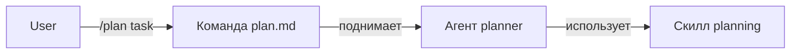

# Команда

> **Команда = слэш-команда** (`/plan`, `/review`). Шорткат для запуска агента на типовой задаче.

## Команды в workspace-шаблоне

| Команда | Что делает | Какой агент |
|---|---|---|
| `/analyze` | read-only ориентировка по проекту | `planner` |
| `/plan <task>` | план в `docs/plans/` | `planner` |
| `/review` | проверка незакоммиченных изменений | `reviewer` (subtask) |
| `/intake <path>` | разобрать внешний материал | `planner` |
| `/inventory <asset>` | обновить `data/inventory.md` | `data-operator` |

## Где живёт

```
.opencode/commands/analyze.md
.opencode/commands/plan.md
.opencode/commands/review.md
.opencode/commands/intake.md
.opencode/commands/inventory.md
```

Имя файла = имя команды (без слэша).

## Формат файла

```markdown
---
description: Produce a safe step-by-step plan for the requested task
agent: planner
---

Task: $ARGUMENTS

Use the `planner` agent and `planning` skill.

Required steps:
1. Read .opencode/rules/dispatch-policy.md, workflow.md, planning.md.
2. If task involves data → also read data-operations.md.
3. ...

Produce a plan file at `docs/plans/<slug>.md` with:
- Goal
- Affected files
- Steps
- Risks
- Verification
- Rollback
```

> [!note]
> `$ARGUMENTS` — то, что пользователь напишет после `/plan ...`.

## Поля frontmatter

| Поле | Что значит |
|---|---|
| `description` | для подсказки в `/` пикере |
| `agent` | какой агент запускать |
| `subtask` | `true` если команда — subagent task (для `/review`) |
| `model` | ❌ не используем, шаблон model-agnostic |

## Как добавить

Создай файл `.opencode/commands/<имя>.md`. OpenCode сам подхватит.

```bash
cat > .opencode/commands/lint.md << 'EOF'
---
description: Run linters on the workspace
agent: reviewer
---

Run all available linters in this workspace. Report issues only. Do not fix.
EOF
```

После этого в OpenCode: `/lint` — работает.

## Команда vs Агент



Команда — **тонкий запускатель**, не делает работу сама. Работу делает [[агент]] через [[скилл]].

## Связано

- [[агент]] — кто работает
- [[скилл]] — что используется
- [[../workflow/дневной-цикл]] — когда какая команда
