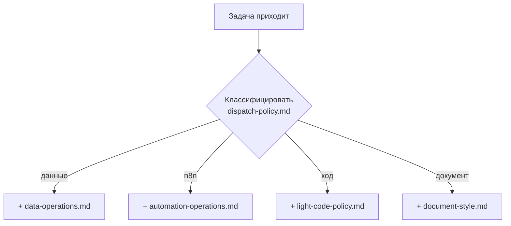

# Правило

> **Правило = константа.** Что нужно делать всегда, что нельзя никогда. Жёстко.

## Примеры живых правил

```
.opencode/rules/
├── dispatch-policy.md            как классифицировать задачу
├── workflow.md                   общий workflow
├── security.md                   секреты, опасные команды
├── git-operations.md             git правила
├── data-operations.md            данные, БД, бэкапы
├── automation-operations.md      n8n, автоматизации
├── light-code-policy.md          маленькие скрипты
├── document-style.md             стиль документации
├── brainstorm.md                 правила брейншторма
└── planning.md                   правила планирования
```

## Как агент знает про правила

Через `AGENTS.md`:

```markdown
@.opencode/rules/dispatch-policy.md
@.opencode/rules/workflow.md
@.opencode/rules/git-operations.md
@.opencode/rules/security.md

# AGENTS.md
...
```

Эти 4 правила подгружаются **всегда**. Остальные — по таблице "Read on demand":

| Задача связана с… | Прочитать |
|---|---|
| Данные / БД / бэкапы | `data-operations.md` |
| n8n / автоматизации | `automation-operations.md` |
| Скрипты / сканеры | `light-code-policy.md` |
| Документация | `document-style.md` |
| Брейншторм | `brainstorm.md` |
| Планирование | `planning.md` |



## Формат правила

Простой markdown — никакого frontmatter. Список запретов, разрешений, шагов.

Пример из `security.md`:

```markdown
# Security Rules

## Secrets
Never commit:
- API keys
- tokens
- passwords
- .env files
- auth.json

## Dangerous Commands
Never run automatically:
- rm -rf
- git reset --hard
- git push --force
- docker volume rm
```

## Когда создавать новое правило

- ограничение на уровне ВСЕГО проекта
- касается нескольких [[агент|агентов]]
- безопасность / git / данные

## Когда НЕ создавать

- правило важно только для одного агента → ставь в [[агент]]ский файл
- это процедура, а не запрет → это [[скилл]], не правило

## Связано

- [[агент]] — следует правилам
- [[../безопасность]] — самые важные правила одним списком
