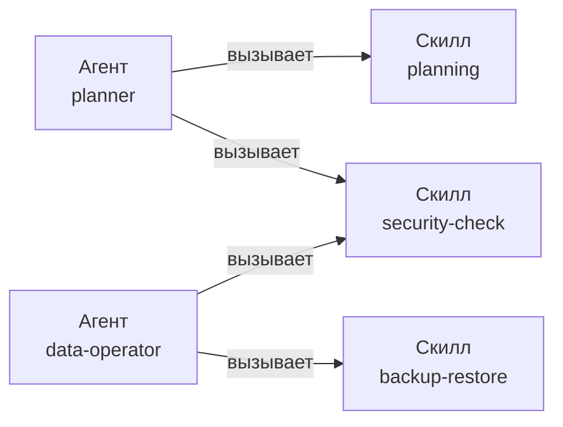

# Скилл

> **Скилл = процедура.** Пошаговая инструкция КАК что-то делать. Не привязан к роли — любой агент может вызвать.

## Пример живых скиллов

| Скилл | Что делает |
|---|---|
| `brainstorm` | structured option-generation с understanding lock |
| `planning` | разложить задачу на шаги с верификацией и rollback |
| `git-safe-commit` | inspect → secret scan → manual commit |
| `backup-restore` | бэкап + **проверенный** restore + запись в runbook |
| `n8n-workflow-doc` | задокументировать n8n workflow безопасно |
| `security-check` | read-only поиск секретов и опасных команд |

## Агент vs Скилл



Один скилл может использовать несколько агентов.

## Где живёт

```
.opencode/skills/brainstorm/SKILL.md
.opencode/skills/planning/SKILL.md
.opencode/skills/backup-restore/SKILL.md
```

Каждый скилл — папка с файлом `SKILL.md` (имя файла ровно такое).

## Формат файла

```markdown
---
name: backup-restore
description: Процедура создания бэкапа И проверки restore. Без проверенного restore бэкап неполный. Use for WSL export, Docker volume, n8n data. RU/UA/EN keywords here.
---

# Backup-Restore

## Когда использовать
- меняется Docker volume
- меняется n8n data
- создаётся новая БД

## Шаги
1. Identify volume / path
2. Document backup command
3. Run backup
4. Verify archive
5. Document restore command
6. Test restore on a copy
7. Update data/inventory.md

## Чего НЕ делать
- не удалять оригинал до verified restore
- не коммитить бэкап-архивы
```

> [!warning] Только два поля в frontmatter
> Anthropic Agent Skills spec признаёт только `name` и `description`. Поля `allowed-tools`, `risk`, `source` → **молча игнорируются** обоими шеллами. Не пиши их.

## Как добавить

```bash
cd ~/code/my-workspace
new-skill-doc backup-restore
```

Скрипт создаёт `.opencode/skills/backup-restore/SKILL.md` со скелетом.

## Принцип

> [!tip]
> Скилл — это **конкретная** процедура. Если шаги совпадают с другим скиллом → у тебя не новый скилл, а дубликат старого.

## Связано

- [[агент]] — кто вызывает скилл
- [[правило]] — что нельзя в процессе
