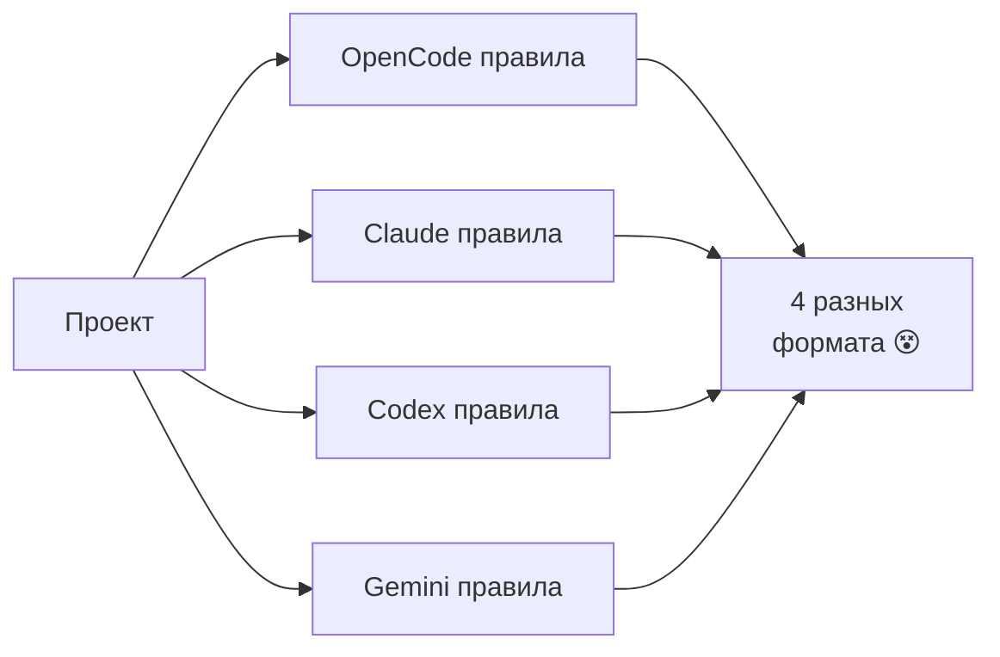
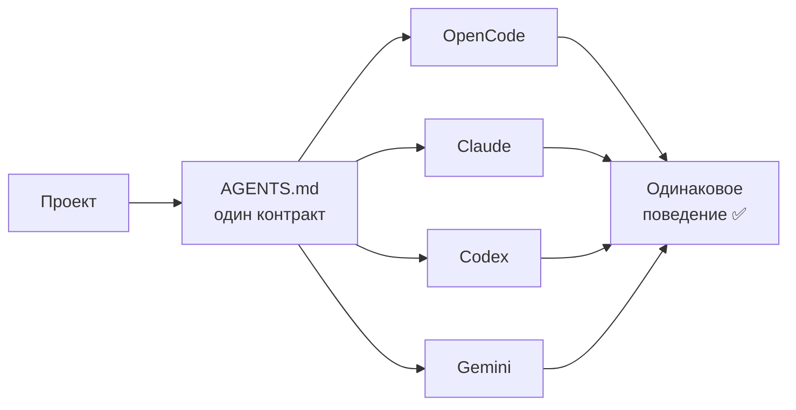

# Обзор

## Проблема

У тебя есть проекты. Ты работаешь с **OpenCode**, **Claude Code**, **Codex**, **Gemini** — у каждого свой формат правил.



## Решение

Один общий контракт **`AGENTS.md`**. Все шеллы читают его одинаково.



## Три слоя

```
┌─────────────────────────────────┐
│ 1. Твоя работа                  │  docs/, data/, code/, automations/
├─────────────────────────────────┤
│ 2. Общий контракт (AGENTS.md)   │  агенты, скиллы, правила, команды
├─────────────────────────────────┤
│ 3. Адаптеры под каждый шелл     │  opencode.json, .claude/, .codex/
└─────────────────────────────────┘
```

| Слой | Что там | Кто использует |
|---|---|---|
| 1 | твои файлы | ты |
| 2 | `AGENTS.md`, `.opencode/agents/`, `.opencode/skills/`, `.opencode/rules/`, `.opencode/commands/` | **все шеллы** |
| 3 | `opencode.json`, `.claude/settings.json`, `.codex/config.toml`, `.gemini/settings.json` | **один конкретный шелл** |

## Зачем это нужно

- **Один проект работает в любом шелле.** Можно открыть OpenCode сегодня, Claude завтра — правила те же.
- **Безопасность по умолчанию.** Не пушит, не коммитит без явного запроса, не трогает секреты.
- **Не теряется контекст.** Все правила в файлах, агент читает их сам.

## Дальше

- [[установка]] — как поставить
- [[концепции/README|Концепции]] — что такое агент, скилл, правило, команда
- [[структура-файлов]] — где что лежит
