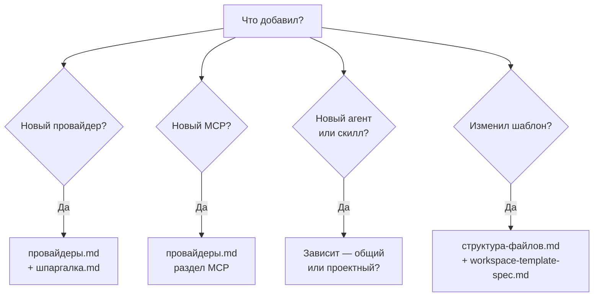

# Обслуживание системы

> Чек-листы для случаев, когда добавляешь что-то новое — провайдер, MCP, агента, шаблон. Чтобы вики и шаблоны не разъехались.

## Когда что обновлять



## Добавил нового провайдера (Ollama, OpenRouter, ...)

- [ ] Прописал в `~/.config/opencode/config.json` блок `provider`
- [ ] Указал ENV переменную (`*_API_KEY`)
- [ ] Обновил `wiki/провайдеры.md` — добавить в таблицу провайдеров
- [ ] Если локальный — описал шаг установки (Ollama serve / LM Studio)
- [ ] Если используется агентом — поменял `model:` во frontmatter

## Добавил MCP-сервер

- [ ] Прописал в `opencode.json` блок `mcp.<имя>`
- [ ] Тип `local` или `remote`, команда — массив
- [ ] Секреты в `env`, не в коде
- [ ] Обновил `wiki/провайдеры.md` — раздел "Добавить MCP в проект"
- [ ] Если используется кросс-проектно — описал в README workspace'а

## Добавил агента

**Глобальный** (для всех проектов) — в `~/.config/opencode/agents/<slug>.md`:
- [ ] Создал `.md` файл (или через `new-agent-doc` внутри workspace, потом скопировал)
- [ ] Frontmatter: `description`, `mode`, `permission` (без `name:`, `tools:`, bare `model:`)
- [ ] Описал в `wiki/концепции/агент.md` если это новый паттерн

**Проектный** — в `project/.opencode/agents/<slug>.md`:
- [ ] То же frontmatter
- [ ] Зарегистрировал в `dispatch-policy.md` проекта (когда вызывать)
- [ ] Обновил `AGENTS.md` проекта если меняется контракт

## Добавил скилл

- [ ] Создал `.opencode/skills/<slug>/SKILL.md`
- [ ] Frontmatter — только `name:` и `description:` (без `risk:`, `allowed-tools:`)
- [ ] Если общий — перенёс в `~/.config/opencode/skills/`
- [ ] Описал в `wiki/концепции/скилл.md` если новая категория

## Изменил структуру workspace-шаблона

- [ ] `wiki/структура-файлов.md` — обновить дерево
- [ ] `docs/workspace-template-spec.md` — обновить полную спеку
- [ ] Прогнал `new-agent-workspace test` → удалил, проверил что чистый старт работает

## Изменил dispatch-policy / workflow / security rules

- [ ] Обновил соответствующий файл в `.opencode/rules/`
- [ ] Если изменилось поведение для всех проектов — синхронизировал в шаблоне
- [ ] Обновил `wiki/безопасность.md` если меняются правила безопасности

## Изменил permission блок

- [ ] Проверил, что `git push*: deny` и `rm -rf *: deny` остались
- [ ] Обновил `wiki/шпаргалка.md` — "Минимальный безопасный шаблон permission"
- [ ] Прошёлся по агентам — нет ли у кого override'а

## Обновил Claude Code / Codex / Gemini интеграцию

- [ ] Файл шаблона (`CLAUDE.md` / `.codex/config.toml` / `GEMINI.md`)
- [ ] `wiki/шеллы/<имя>.md` — обновить конфиг и фичи
- [ ] `docs/shells/<имя>/` — детальный reference

## Регулярная проверка (раз в месяц)

- [ ] Все ссылки в вики работают (`[[wiki-link]]` → существующий файл)
- [ ] Нет hardcoded путей `/home/<user>/`
- [ ] Шпаргалка соответствует актуальному состоянию
- [ ] FAQ покрывает реальные вопросы (а не выдуманные)
- [ ] Запустить `sync-wiki` — проверить что конфиг и вики не разъехались:

```
> используй sync-wiki — проверь что все провайдеры, MCP, агенты задокументированы в вики
```

## Проверка через Context7

Когда что-то меняешь в конфигах — сверь с официальной докой:

```
/review проверь docs через context7 — нет ли расхождений
```

Это найдёт устаревшие ключи (`providers` vs `provider`), wrong типы (`stdio` vs `local`), и т.д.

## Связано

- [[структура-файлов]] — карта файлов
- [[провайдеры]] — как добавлять провайдеров/MCP
- [[концепции/агент]] — спека агента
- [[концепции/скилл]] — спека скилла
