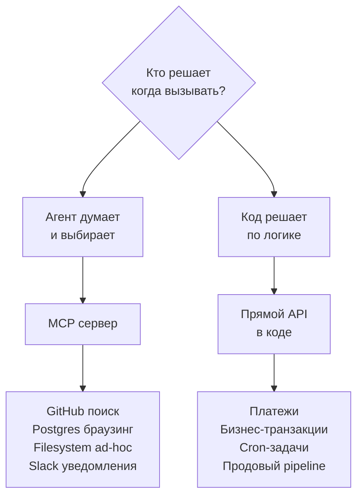

# Провайдеры, модели, MCP

> OpenCode — провайдер-агностик. Клод, OpenAI, Gemini, Ollama, LM Studio — всё работает.

## Поддерживаемые провайдеры

| Провайдер | ID | Где настроить | API ключ |
|---|---|---|---|
| **Anthropic (Claude)** | `anthropic` | глобально | `ANTHROPIC_API_KEY` |
| **OpenAI** | `openai` | глобально | `OPENAI_API_KEY` |
| **Google Gemini** | `google` | глобально | `GEMINI_API_KEY` |
| **Groq** | `groq` | глобально | `GROQ_API_KEY` |
| **OpenRouter** | `openrouter` | глобально | `OPENROUTER_API_KEY` |
| **Ollama** | `ollama` | глобально | — (локальный) |
| **LM Studio** | `lmstudio` | глобально | — (локальный) |

## Локальные модели

### Ollama

```bash
# Установить
curl -fsSL https://ollama.com/install.sh | sh

# Скачать модель
ollama pull llama3.2
ollama pull qwen2.5-coder   # хорош для кода

# Убедиться что сервер запущен
ollama serve
```

В `~/.config/opencode/config.json`:

```json
{
  "provider": {
    "ollama": {
      "npm": "@ai-sdk/openai-compatible",
      "name": "Ollama (local)",
      "options": {
        "baseURL": "http://localhost:11434/v1"
      },
      "models": {
        "llama3.2": { "name": "Llama 3.2" },
        "qwen2.5-coder": { "name": "Qwen 2.5 Coder" }
      }
    }
  }
}
```

В файле агента:

```yaml
---
description: Быстрый локальный помощник для небольших задач
model: ollama/llama3.2
mode: primary
---
```

### LM Studio

1. Открой LM Studio → Start Server (порт 1234)
2. Добавь в `~/.config/opencode/config.json`:

```json
{
  "provider": {
    "lmstudio": {
      "npm": "@ai-sdk/openai-compatible",
      "name": "LM Studio",
      "options": {
        "baseURL": "http://localhost:1234/v1"
      }
    }
  }
}
```

```yaml
---
model: lmstudio/your-model-name
---
```

## MCP vs API — когда что



### Почему ругаются на MCP

| Проблема | В чём суть |
|---|---|
| Контекстный налог | 10 MCP-серверов = +5–15k токенов в каждом запросе |
| Latency | Каждый вызов через JSON-RPC процесс |
| Безопасность | Filesystem MCP с правами на `/` — опасно |
| Дебаг | Ошибки в stdio-протоколе тяжелее ловятся |

**Правило:** 2–3 MCP максимум. Остальное — в API/скрипты.

## Добавить MCP в проект

В `opencode.json` проекта:

```json
{
  "mcp": {
    "github": {
      "type": "local",
      "command": ["npx", "-y", "@modelcontextprotocol/server-github"],
      "enabled": true,
      "environment": {
        "GITHUB_PERSONAL_ACCESS_TOKEN": "${GITHUB_TOKEN}"
      }
    },
    "postgres": {
      "type": "local",
      "command": ["npx", "-y", "@modelcontextprotocol/server-postgres", "${DATABASE_URL}"]
    }
  }
}
```

> [!note]
> Нет ключа `"servers"`. Серверы идут прямо в `"mcp"`. Тип — `"local"` (не `"stdio"`). Команда — массив. Переменные окружения — `"environment"` (не `"env"` как у Claude Code; неправильный ключ молча игнорируется и переменные не попадают в процесс).

Найти серверы: [modelcontextprotocol/servers](https://github.com/modelcontextprotocol/servers) и [awesome-mcp-servers](https://github.com/punkpeye/awesome-mcp-servers).

## Указать модель для агента

```yaml
---
description: Архитектор на мощной модели
model: anthropic/claude-opus-4-7   # claude
---
```

```yaml
---
description: Быстрый проверщик синтаксиса
model: ollama/qwen2.5-coder        # локально
---
```

```yaml
---
description: Дешёвый первичный фильтр
model: openrouter/meta-llama/llama-3.1-8b-instruct
---
```

> [!note]
> Формат: `провайдер/модель-id`. Не просто `sonnet` или `opus` — это только для Claude Code.

## Связано

- [[конфиг-уровни]] — что хранить глобально, что в проекте
- [[workflow/взгляд-агента]] — как агент использует провайдера
- [[шеллы/opencode]] — конфиг opencode.json
