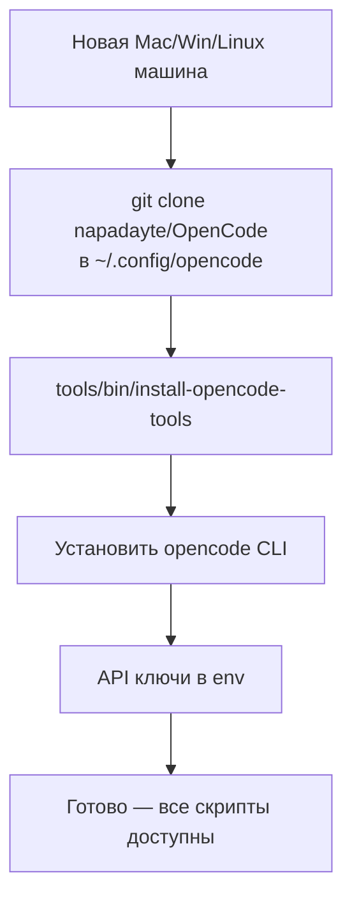
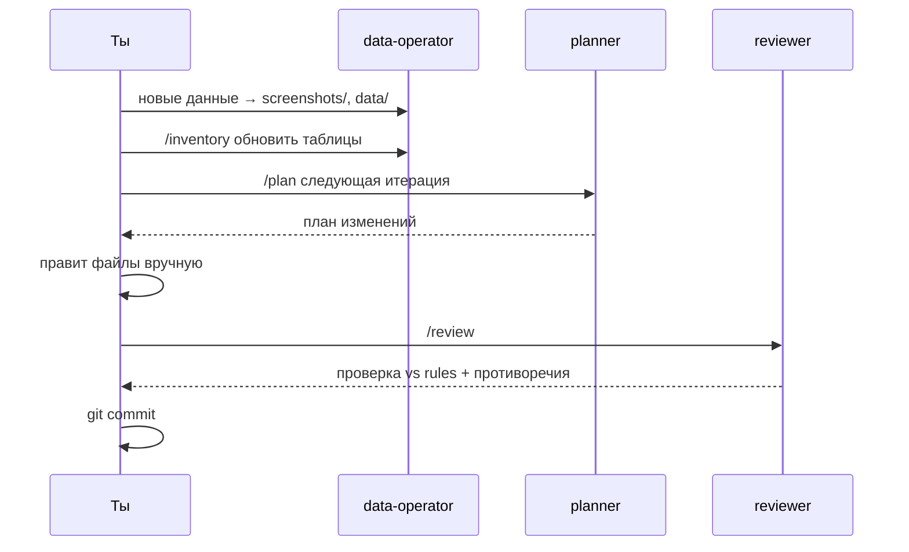

# Универсальный воркфлоу

> Как применять систему к **любой задаче** на **любой машине** — не только код, не только этот PC.

## Когда это нужно

Любая задача, которая больше одного разговора:
- планирование территории / зон обслуживания
- система контроля качества
- исследовательский проект
- база знаний клиентов
- любой data/ops/research-проект

## Принцип

```mermaid
flowchart LR
    A[Любая задача] --> B[new-agent-workspace]
    B --> C[Шаблон даёт<br/>агенты + правила + цикл]
    C --> D[/analyze → /plan → ручная реализация → /review]
    D --> E[Git коммит]
    E --> F[Перенос на другую машину]
```

Шаблон — универсальный. Скрипты — bash, работают на Mac, Linux, WSL. Конфиг — git. Перенёс на другую машину = тот же workflow.

## Этап 0 — Поставить систему на новую машину



```bash
# 1. Клонировать конфиг
git clone https://github.com/napadayte/OpenCode.git ~/.config/opencode

# 2. Установить скрипты в PATH
cd ~/.config/opencode/tools/bin
./install-opencode-tools     # симлинки в ~/.local/bin

# 3. Установить opencode CLI
# Mac:    brew install opencode-ai/tap/opencode
# Linux:  curl -fsSL https://opencode.ai/install | bash
# Win:    через WSL2 или Git Bash

# 4. API ключи (в .zshrc / .bashrc / Win env)
export ANTHROPIC_API_KEY="sk-ant-..."
```

> [!note]
> Чистый Windows без WSL/Git Bash — скрипты не запустятся. Нужен WSL2 или установка через подсистему Linux.

→ [[установка]] — детально

## Этап 1 — Создать workspace под задачу

```bash
new-agent-workspace <slug>     # например: lawn-zones, customer-base, research-2026
cd ~/code/<slug>
opencode
```

Скрипт развернёт шаблон с:
- `AGENTS.md` — контракт
- агенты (planner, reviewer, data-operator)
- скиллы и правила
- структура папок (docs/, data/, automations/)

**Всё работает одинаково на любой машине.**

## Этап 2 — Дать задаче контекст

```
/analyze
```

Агент читает workspace, понимает правила. Затем — большой первый промпт с **полным описанием задачи и её этапами**:

```
/plan создаём систему планирования зон обслуживания.

Контекст:
- 12 этапов: цель → карта → зоны → классы → tool matrix → ...
- Stress-тесты: time / weather / access / face zones / ...
- Минимальный набор данных: фото, список зон, инструменты, ...

Цель: каркас из 8 файлов (01-goal.md, 02-zones.md, ... 08-critique.md)
+ zone register CSV.
```

`planner` создаст `docs/plans/<slug>-system.md` — пошаговый план реализации.

## Этап 3 — Реализация (вручную из плана)

План превращается в файлы. Каждый файл — отдельный шаг:

```
> создай 01-goal.md по структуре из плана
> создай 02-zones.md, начни с пустого реестра
> создай 05-zone-register.csv с колонками: id, site, class, tool, time, status
```

Между шагами:
- `git status`
- `git diff`
- ручной `git commit`

**Агент не коммитит сам.** Это правило `AGENTS.md`.

## Этап 4 — Цикл итераций



## Этап 5 — Доменные скиллы

Когда замечаешь повторяющуюся операцию — оформи скиллом:

```yaml
---
name: stress-test
description: Apply N stress tests to any plan — time, weather,
  access, follow-up backlog, tool fit, meaning.
---

# Steps
1. Read the plan being tested.
2. For each stress vector, simulate failure mode.
3. Identify first breakage point.
4. Report: weakest link + 2 mitigations.
```

Положи в `.opencode/skills/stress-test/SKILL.md`. Теперь в любой момент:

```
> stress-test текущую недельную загрузку
```

Этот скилл переиспользуется на других проектах. Если общий — перенеси в `~/.config/opencode/skills/`.

→ [[концепции/скилл]]

## Этап 6 — Перенос между машинами

Workspace = обычный git-репозиторий:

```bash
# дома
cd ~/code/<slug>
git push

# на работе
git clone <url> ~/code/<slug>
cd ~/code/<slug>
opencode    # та же конфигурация, те же агенты
```

Глобальный конфиг (`~/.config/opencode/`) уже стоит на той машине — workspace его подхватывает автоматически.

## Сводная таблица

| Этап | Команда | Где живёт |
|---|---|---|
| 0. Setup | `git clone` + `install-opencode-tools` | один раз на машину |
| 1. Workspace | `new-agent-workspace <slug>` | один раз на задачу |
| 2. Контекст | `/analyze` + первый `/plan` | каждый старт |
| 3. Реализация | `/plan` → вручную → commit | каждый день |
| 4. Итерация | `/plan` → `/review` → commit | по мере данных |
| 5. Скиллы | новый файл в `.opencode/skills/` | по мере паттернов |
| 6. Перенос | `git push` / `git clone` | между машинами |

## Что важно понимать

> [!important]
> **Система — это не "AI делает план"**. Это рабочее пространство, где живут карта, зоны, правила, инструменты, решения, критика. AI помогает структурировать, проверять противоречия, обновлять таблицы. Базовую модель ты делаешь сам.

## Связано

- [[установка]] — поставить систему
- [[workflow/дневной-цикл]] — твой ежедневный цикл
- [[workflow/взгляд-агента]] — как работает агент изнутри
- [[обслуживание]] — как поддерживать систему при росте
