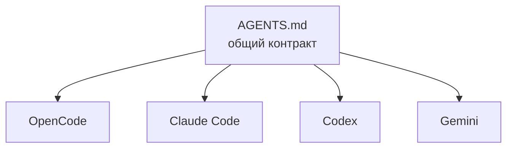

# Шеллы

4 AI-шелла. Один общий контракт `AGENTS.md`.

## Карта



## Сравнение

| Шелл | От кого | Конфиг | Что читает первым |
|---|---|---|---|
| [[opencode]] | Anomaly | `opencode.json` + `.opencode/` | `AGENTS.md` + `instructions` |
| [[claude-code]] | Anthropic | `.claude/settings.json` + `CLAUDE.md` | `CLAUDE.md` → `AGENTS.md` |
| [[codex]] | OpenAI | `.codex/config.toml` | `AGENTS.md` |
| [[gemini]] | Google | `.gemini/settings.json` + `GEMINI.md` | `GEMINI.md` → `AGENTS.md` |

## Главный принцип адаптеров

Каждый шелл читает **свой адаптер**:

```
CLAUDE.md       → @AGENTS.md (Claude читает AGENTS.md по ссылке)
GEMINI.md       → @AGENTS.md (то же для Gemini)
.codex/         → говорит Codex'у "следуй AGENTS.md"
opencode.json   → у OpenCode AGENTS.md в `instructions` массиве
```

> [!note]
> Адаптеры **не дублируют** контент `AGENTS.md`. Они просто говорят шеллу "читай его".

## Какой шелл когда

| Использовать | Когда |
|---|---|
| **OpenCode** | основной workflow, агенты, скиллы, команды |
| **Claude Code** | большой контекст, сложный refactor, длинные документы |
| **Codex** | задачи через ChatGPT подписку, быстрые проверки |
| **Gemini** | альтернативное мнение, ревью документации |

Подробнее — на странице каждого шелла.
